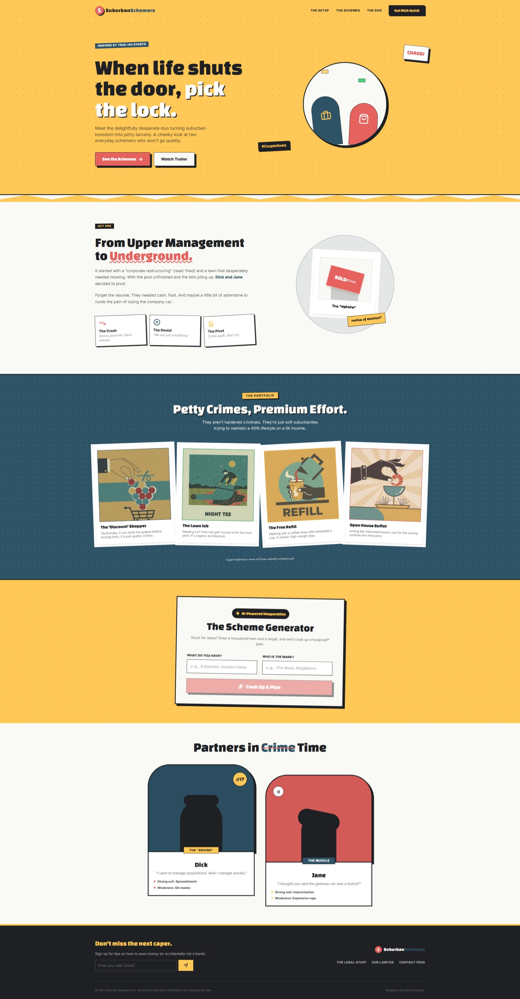

# The Suburban Schemers

**When life shuts the door, pick the lock.**

Welcome to **The Suburban Schemers**, a delightfully desperate web experience inspired by the chaotic energy of movies like "Fun with Dick and Jane". This project showcases a retro-styled landing page for a fictional duo turning suburban boredom into petty larceny, featuring an **AI-powered Scheme Generator** that cooks up foolproof* criminal plots on demand.

> *Results may vary. Prison time possible.*

---

## Screenshot



---

## Features

-   **AI Scheme Generator**: Powered by Google's **Gemini Flash 2.5**, this tool takes a household item and a target (the "mark") to generate a hilarious, absurd, and petty criminal scheme.
-   **Retro 70s Aesthetic**: A fully custom design system featuring a "Mustard & Ketchup" color palette, brutalist borders, retro shadows, and period-appropriate typography.
-   **Responsive Design**: Built with Tailwind CSS to look great on everything from a vintage desktop to a modern smartphone.
-   **Interactive UI**: Smooth animations, hover effects, and a dynamic user experience.

## Tech Stack

-   **Frontend Framework**: [React 19](https://react.dev/)
-   **Build Tool**: [Vite](https://vitejs.dev/)
-   **Language**: [TypeScript](https://www.typescriptlang.org/)
-   **Styling**: [Tailwind CSS](https://tailwindcss.com/) (Custom config)
-   **Icons**: [Lucide React](https://lucide.dev/)
-   **AI Integration**: [Google GenAI SDK](https://www.npmjs.com/package/@google/genai)

## Getting Started

Follow these steps to get the project running locally on your machine.

### Prerequisites

-   **Node.js** (v18 or higher recommended)
-   **npm** or **yarn**
-   A **Google Gemini API Key** (Get one [here](https://aistudio.google.com/app/apikey))

### Installation

1.  **Clone the repository** (if applicable) or download the source code.
2.  **Install dependencies**:
    ```bash
    npm install
    ```

### Configuration

1.  Create a `.env.local` file in the root directory of the project.
2.  Add your Gemini API key to the file:
    ```env
    GEMINI_API_KEY=your_actual_api_key_here
    ```
    > **Note**: The application is configured in `vite.config.ts` to map `GEMINI_API_KEY` to `process.env.API_KEY` for use in the application.

### Running the App

Start the development server:

```bash
npm run dev
```

Open your browser and navigate to `http://localhost:3000` (or the port shown in your terminal).

## Project Structure

```text
├── components/          # React components
│   ├── Hero.tsx         # Main landing section
│   ├── SchemeGenerator.tsx # AI interaction component
│   ├── Navbar.tsx       # Navigation bar
│   ├── Footer.tsx       # Footer section
│   └── ...              # Other UI sections (Duo, Schemes, TheSetup)
├── App.tsx              # Main application entry point
├── main.tsx             # React DOM rendering
├── vite.config.ts       # Vite configuration & env var mapping
└── ...
```

## How the AI Works

The **Scheme Generator** (`components/SchemeGenerator.tsx`) uses the Google GenAI SDK to communicate with the Gemini model.
1.  It constructs a prompt asking for a "short, hilarious, absurd, and petty criminal scheme" based on the user's inputs.
2.  It sets the tone to be "desperate but harmless, 1970s suburban style".
3.  The response is displayed in a retro-styled card on the UI.

## License

This project is open source and available under the [MIT License](LICENSE).
